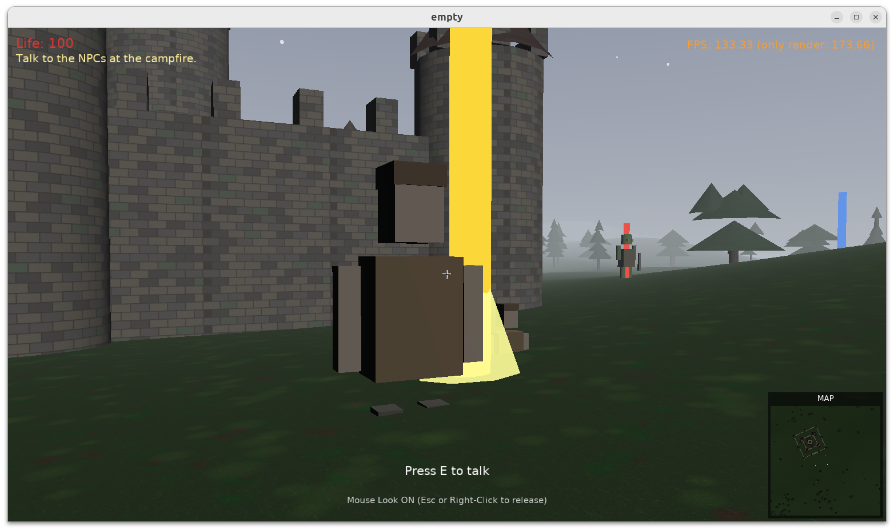
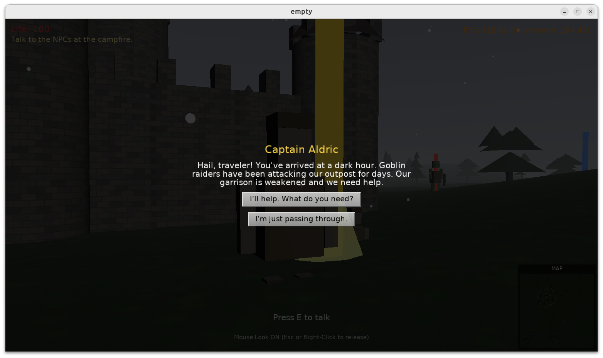
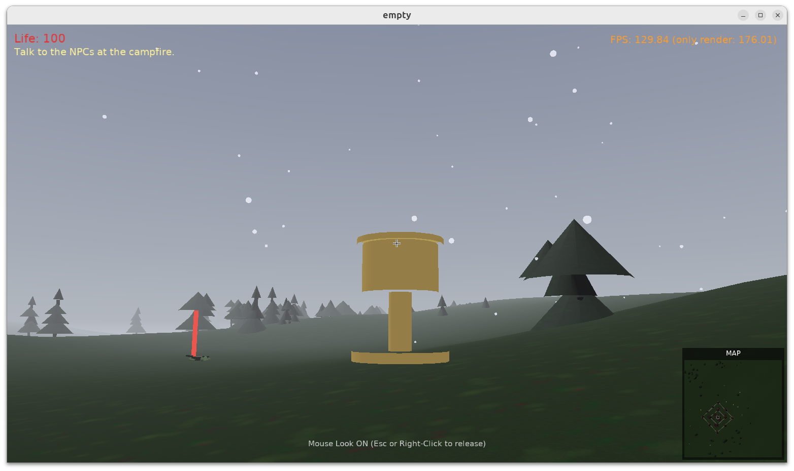

# Castle Vibes: Vibe-coded game using Castle Game Engine

## Introduction: why test vibe-coding

This was a test of "vibe coding", i.e. creating an application _with AI (Claude Code), without reviewing or manually editing the source code at all_.

To be clear, **this was done for fun, to experiment with a technique (even if it's a technique I may consider stupid :) ). This is not a way to create reliable, maintainable, larger games -- it will just not work, see below for details. Also, do not blindly use this code as a valid inspiration. Rather use existing, over 150 by now, [engine examples](https://github.com/castle-engine/castle-engine/tree/master/examples). Follow [our AI usage guidelines](https://castle-engine.io/ai) how to use AI is a saner way.**

But, hey, it's 2026, we're all excited (and scared at the same time?) by the possibilities (and dangers of misuse) of AI. As a reasonable person, I wanted to make a real test to see what I can get. And it was fun, and some bits have been impressive!

## Screenshots

## Details about AI usage, observations and possible next steps

I used _Claude Code (Opus 4.6)_. It took me about 15 prompts to reach this, about 1h of prompting and testing. I was merely writing prompts and testing the game as a user. Some of the prompts were quite high level (e.g. _"add 6 goblins, make a quest to slain 6 goblins"_), some were more concrete and lower level and assuming knowledge of 3D and our engine (e.g. _"the collisions on castle 3D model are wrong, set `PreciseCollisions` to `true` on the `TCastleScene` with the castle"_ or _"castle towers look inside-out because of backface culling, flip the order of the vertexes in their triangles"_).

This README file is the only file I edit by hand, plus I manually made and added a few screenshots (linked below). Everything else is made by AI. Explore it for curiosity, but be critical -- as explained below, and emphasized in [our AI usage guidelines](https://castle-engine.io/ai), AI code is not a good code.

Frankly, it seems that AI ability to maintain and extend this is at limits. And yes, the codebase has a lot of approches I would consider wrong -- making it hard to maintain and extend (for both humans and AI).

Observations:

- It is maybe the worst game I ever made/played, but **it is playable, which is impressive in itself. You can walk around a winter scenery with a 3D castle, fog, falling snow, some forest, minimap. You can get a quest to slain 6 goblins, and do it, and at the end you get the reward - trophy appears**.

- AI made stupidest errors along the way (like miscounting the slain goblins). I pointed them out, but various detections seem to work still ~randomly.

- AI did half-correctly use our `TCastleView` for a dialog (talk with NPC) logic, likely because [it found engine example doing exactly this](https://github.com/castle-engine/castle-engine/tree/master/examples/3d_games/walking_adventure). The dialog UI is needlessly generated using Pascal, resulting in long and hard to modify UI -- rather use editor, and design UI there. For AI, it was apparently easier to wrote Pascal code to generate UI rather than edit `.castle-user-interface` JSON files, even though I directed it to try the latter.

- In general, it looked at _Castle Game Engine_ source code on my disk, including the [CLAUDE.md in engine repo](https://github.com/castle-engine/castle-engine/blob/master/CLAUDE.md), and correctly did _some_ things following our established examples.

- The snowflakes are very cool, look good, and work reasonably (albeit disappear if you walk too fast). Though their implementation is super-unoptimal, using 400 instances of `TCastleSphere`. At the very least, you should use `TCastleTransformReference` to have only 1 sphere in resources. But I cannot argue -- the approach made by AI is "good enough" for this trivial demo.

- It generated the glTF models using Python, directly generating the JSONs. This is not what I would advise, instead:

  - If you cannot make art yourself, then use a number of [open-source 3D assets we collect here](https://castle-engine.io/assets.php).

      - Or even 3D asset AI generators, if that's your thing. Though my experience with them wasn't positive... but things improve, maybe in 2026 they are better.

  - If you can make art yourself, then of course do it. We support [Blender](https://castle-engine.io/blender), [Maya](https://castle-engine.io/maya) and [other authoring tools](https://castle-engine.io/export_models). This is how you will actually get what you want to have, not something random.

  - If you really want to procedurally generate 3D art, you can do it without Python (like AI did here). In _Castle Game Engine_ we have an extensive API to build / modify 3D content using [X3D nodes](https://castle-engine.io/x3d). No Python necessary, no need to even save the result to disk (as glTF, X3D or whatever) -- you could just generate the content during game loading. I could possibly modify this game to use our approach -- but there's a moment when you're tired of prompting and managing the chaos :)

If I would like to continue this experiment, my next things would be:

- Change Python code generating the assets into Pascal code using our engine nodes.

- I would [download some 3D assets](https://castle-engine.io/assets.php) for goblins and tell it to just use them.

- I would direct it to use [TCastleMoveAttack](https://castle-engine.io/wp/2024/10/21/demo-game-using-blender-sketchfab-quaternius-models-tcastlemoveattack-early-preview-of-tcastlemoveattack-merged-slides-from-conference-last-week/) which is a more straightforward way to have 3D enemies logic.

Still, this is _much better than any test I've done with AI agents in 2025_. It is impressive how AI capabilities progressed -- even if it's still a random mess of bugs and random outcomes that I don't control at all.

## Support us

Have fun using [Castle Game Engine](https://castle-engine.io/) and please [support the humans behind the engine :)](https://www.patreon.com/c/castleengine).

## Building

Using [Castle Game Engine](https://castle-engine.io/).

Compile by:

- [CGE editor](https://castle-engine.io/editor). Just use menu items _"Compile"_ or _"Compile And Run"_.

- Or use [CGE command-line build tool](https://castle-engine.io/build_tool). Run `castle-engine compile` in this directory.

- Or use [Lazarus](https://www.lazarus-ide.org/). Open in Lazarus `empty_standalone.lpi` file and compile / run from Lazarus. Make sure to first register [CGE Lazarus packages](https://castle-engine.io/lazarus).

- Or use [Delphi](https://www.embarcadero.com/products/Delphi). Open in Delphi `empty_standalone.dproj` file and compile / run from Delphi. See [CGE and Delphi](https://castle-engine.io/delphi) documentation for details.